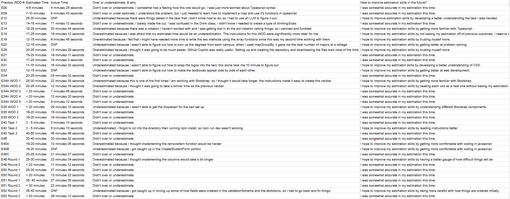

<!-- How did you make your effort estimates? Explain your basis and any historical data you used.
Even though your estimates were often off, did estimating in advance provide any benefit? Provide examples.
Was tracking actual effort useful? If so, how did it inform future estimates or project decisions?
How did you track your actual effort (tools, method)? How accurate do you believe your tracking was?
Reflection: what would you change about your estimation or tracking process next time?
AI use (if applicable): Did you use AI tools for estimating or tracking effort? For each AI tool used, provide:
Tool name/provider and model/version.
Exact prompts or representative prompt iterations (redact secrets).
Time spent on prompt engineering, generation, and verification (break out minutes per bucket).
What portions of the responses were accepted as-is, and what required manual edits or correction? -->

<h1> Initial Thoughts </h1>

Prior to this class, effort estimation was a foreign concept to me. In completing tasks, I would typically just get straight to work and work until completion without any forethought about how long it might take. However, from experience in this class, I learned that effort estimation is a critical skill in software engineering that can help with project planning, resource allocation, and setting realistic expectations by understanding the complexity of the task and personal ability to complete the task. This skill is especially important in a professional setting where deadlines are tight, where you need to communicate effectively with stakeholders, and where you need to manage your time efficiently.

<h1> Methods and Benefits </h1>

To make my effort estimates, I would first read the instructions and try to understand the task at hand. Then based on the instructions, I try to think of high level approaches of how I would complete the task, and reflect whether my technical skills will allow me to complete the task. Based on this reflection, I would make an estimate of how long I think it would take me to complete the task. Although my estimates were often off, estimating in advance provided several benefits. For example, it helped me prioritize tasks and allocate my time more effectively. It also helped me identify potential roadblocks or challenges that I might encounter during the task, allowing me to plan accordingly. Additionally, tracking actual effort was useful as it allowed me to compare my estimates with the actual time taken, which informed future estimates and project decisions. I tracked my actual effort using a simple spreadsheet where I recorded the start and end times for each task. While I believe my tracking was fairly accurate, there were instances where I overestimated or underestimated how difficult/easy the task ended up being.

I felt that estimating efforts helped me understand not only the scope of the assignment/project better, but it also helped me reflect on my own skills and capabilities. By making estimates, I was able to identify areas where I needed to improve my skills or knowledge, which helped me become a better engineer and problem solver.

<h1> Final Thoughts </h1>

Overall, I believe that effort estimation is a valuable skill that can benefit software engineers in both their personal and professional lives. I see effort estimation as a form of time management that helps me become more efficient and effective in completing tasks. In the future, I would like to further improve my estimation skills by seeking feedback from peers or mentors, and by practicing more frequently. I would also like to explore ways to automate the tracking process using tools or software that can help me monitor my time more accurately, instead of manually recording start and end times.

