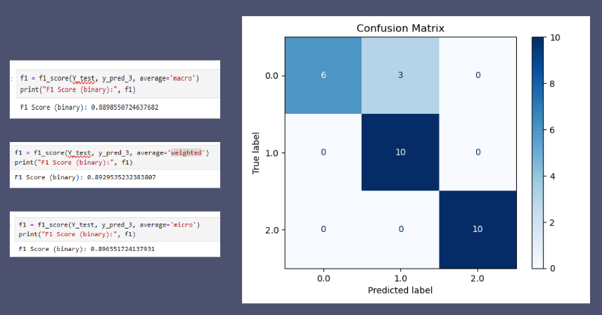

After a semesters of work, I developed a machine learning pipeline that analyzes network traffic on a dataset I found online. Coming in to this project, I had little experience with network traffic analysis and zero trust architecture, so I had to do a lot of research to understand the concepts and the data. I learned about different types of network traffic data, such as NetFlows and packets, and how to preprocess and clean the data for analysis. I also learned about different machine learning algorithms, such as K-means clustering, XGBoost, and multilayer perceptrons, and how to implement them using Python and popular libraries such as Scikit-learn.

Thus far, me and my mentor Curt Dodds have built a machine learning pipeline that preprocesses the network traffic data, extracts relevant features, and trains and evaluates different machine learning models. We have experimented with different hyperparameters and architectures to optimize the performance of the models. Using an online dataset, I was able to learn K-means clustering to group similar network traffic patterns together, finding 6 distinct clusters. Although the clusters weren't labaled and didn't have ground truth, I was able to visualize the clusters using dimensionality reduction techniques such as PCA and t-SNE, and interpret the clusters based on their characteristics. Next, I built and trained an XGBoost model and multiple multilayer perceptron to classify network traffic anomalies on the dataset. I evaluated the models using metrics such as accuracy, precision, recall, and F1-score, and compared the performance of different models. To improve  performance of the models, I experimented with different feature engineering techniques such as hyperparameter tuning and data resampling. This helped improve one of my models from 0.725 to 0.89 accuracy.

As of now, I am continuing to work on this project with my mentor Curt Dodds. He is working on gathering sampled network traffic data from various astronomy telescope sites owned by the university. We plan to use this data to reach our goal of ultimately categorizing user roles and device types based on their network traffic patterns. Overall, this project has been a great learning experience for me, and I am excited to continue working on it and contribute towards AI-driven Zero Trust Architecture.

