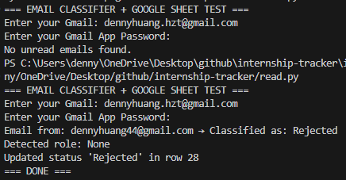

For my internship application tracker project, I developed a Python script that utilizes the iMAP protocol to connect to my email account and automatically track internship application emails. The script scans my inbox for emails from specific companies and extracts relevant information such as the company name, position applied for, application date, and status of the application. The script then opens a google sheets document and updates my applications for the given company and position with the extracted information. This allows me to easily keep track of my internship applications and their statuses without having to manually search through my emails. The process isn't fully automated yet, currently requiring me to run the script manually, but I plan to set it up to run on a schedule in the future. 

You can check out the project [here](https://github.com/DennnnyH/internship-tracker)