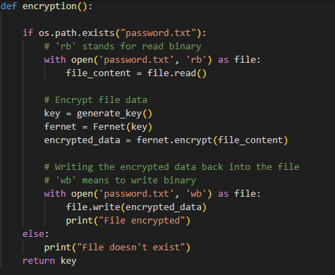

The goal of this coding project was to create a password manager that I could use to store passwords for a variety of websites and applications that I use.

Creating a random password generator and storing everything was relatively easy. The challenging part came from implementing an encryption system where all the passwords
I generated would get stored in a .txt file on my desktop, and the .txt file would open as an encrypted string without going through decryption via the IDE. To do the encryption
process, I used Fernet to generate an encryption key and encrypt all the content I need. The decryption process requires the user to input a set password.

This was a good learning experience, as I was able to work with some libraries that were new to me. Reading some documentation and using LLMs for some assistance definitely made the
project a lot easier to manage and complete.

