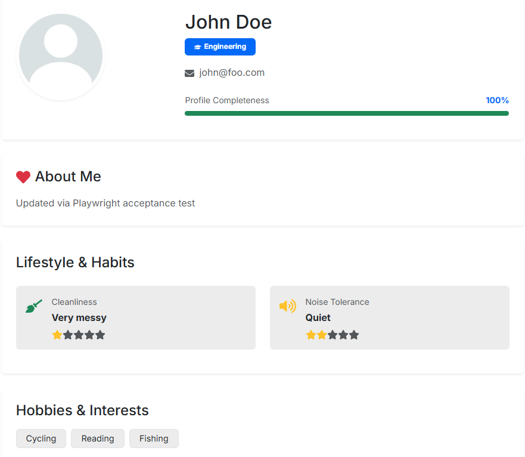

Webapplication that helps college students find compatible roommates by matching users based on their preferences and lifestyle choices. Built using React for the frontend, Node.js and Next.js for the backend, Bootstrap for styling, and PostgreSQL for database management. In the process of building this project, I gained hands-on experience with full-stack web development, including designing user interfaces, implementing server-side logic, and managing databases. The application allows users to create profiles, specify their roommate preferences, view potential matches based on compatibility scores, message potential roommates, and manage their roommate matches. This project not only enhanced my technical skills but also provided valuable insights into user experience design and the importance of data-driven decision-making in application development.

Throughout the development lifecycle, our group also used agile methodologies to manage tasks and ensure timely delivery of features. We utilized version control with Git and collaborated through platforms like GitHub to streamline our development process. This project has been a rewarding experience, allowing me to apply my knowledge in a practical setting while addressing a common challenge faced by college students. In addition, we also implemented playwright testing to ensure the reliability and functionality of the application across different scenarios and deployed the application using Vercel for seamless hosting and accessibility.

You can check out the project [here](https://github.com/manoa-roomie-match).